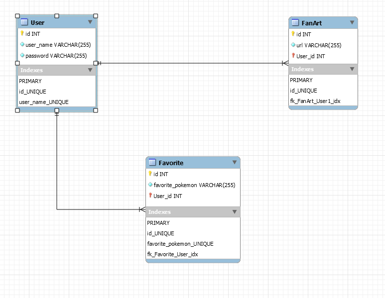

# PokedexAndFanart
A web application where people can post their fan art for Pokemons and view/favorite different Pokemon

## Technologies and Frameworks Used
### Heroku
### Django
### React
### Javascript, HTML, CSS
### Django Rest Framework(DRF)
### Gunicorn
### Django Heroku
### Psycopg2-Binary
### Requests
### Ant Design
### Aphrodite
### Axios
### Random Color
### Styled Components

## Tools Used
### Zenhub
<https://www.zenhub.com/>
### Postman
<https://www.getpostman.com/>
### ReText
<https://github.com/retext-project/retext>

## Prerequisites
### NodeJS v10.16.0^
<https://nodejs.org/en/>
### PSQL v10.8^
<https://www.postgresql.org/>
### NPM v6.9.0
<https://www.npmjs.com/>
### PIPENV v2018.11.26^
<https://github.com/pypa/pipenv>
### Python 3.6

## To Test On Local Machine
1. Clone repository to your local machine
2. Run `pipenv install` in the root directory of project
3. Run `cd client` in the project root and then run `npm i` in the client directory
4. - Run `psql -U postgres -f settings.sql` * OR * Go into psql terminal and run each command from settings.sql seperately to create database
5. Run `pipenv shell`
6. Run `python3 ./manage.py makemigrations`
7. Run `python3 ./manage.py migrate`
8. Lastly, run `python3 ./manage.py runserver` to start Django development server on Localhost 8000
9. On a seperate terminal, run `cd client` then `npm start` to run the React frontend server on Localhost 3000
10. Run stepes 6-8 as needed when changes to the model is made.

## Entity Relations Diagram(ERD)

## React Component Tree

## Zenhub Project Board
<https://app.zenhub.com/workspaces/workspace-5cf940801b8cc8533860ca4f/board?repos=190614103>

## Deployed Project
<https://pokemon-fanart.herokuapp.com/>

## References
* <https://i.pinimg.com/originals/05/de/c6/05dec65a440a989f71628da2d76db0f9.jpg>
* <https://www.furretturret.com/resources/hd/shiny>
* <https://pokeapi.co/>
* <https://github.com/PokeAPI/pokeapi>
* <http://25.media.tumblr.com/fbb96a4b42c26fc2aa303924ad4cfd2b/tumblr_mho10qt37d1reats2o1_r1_500.gif>

## Licence
[MIT](https://github.com/nishanths/license/blob/master/LICENSE)